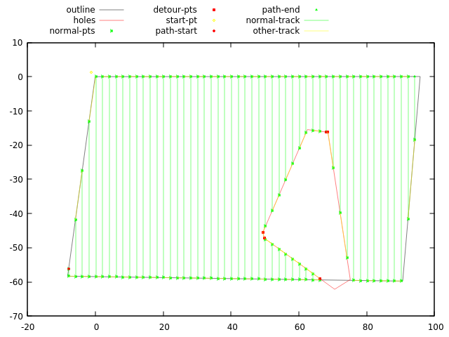

# coverage_planning_2d

**A repo. which maintains package about 2d coverage path planning for uav.**

## Dependencies

1. `boost-1.71.0.0ubuntu2`

   ```bash
   sudo apt install libboost-dev
   ```

2. `gnu-plot`

   ```bash
   sudo apt install gnuplot
   ```

## Build

```bash
mkdir build && cd build
cmake ..
make -j

# test
./test_work_route_2
```

## Install

If you want to get generated headers and libraries, refer commands below and you can copy directory named `install`.

```bash
make install
copy ../install tgt_path
```

## Example

Refer to code `test/work/test_route_2.cpp`.


